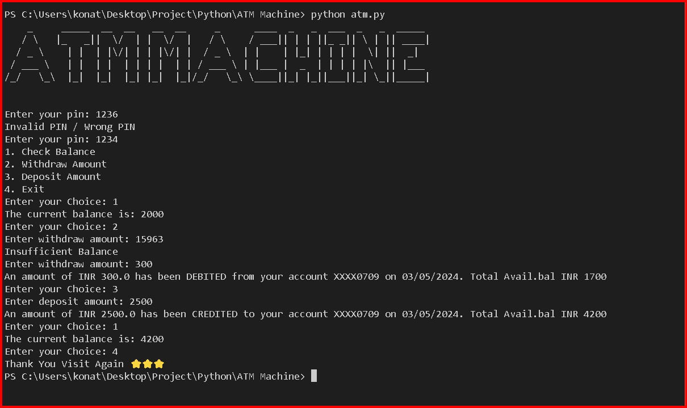

# Hi, I'm Anil Kumar! 👋


# ATM Machine
This Python script simulates basic ATM functionalities such as checking balance, withdrawing and depositing money. It uses ASCII art for a creative display of "ATM MACHINE" at the beginning.

## Features
1. Check Balance: Allows users to check their current balance.
2. Withdraw Amount: Enables users to withdraw money from their account, with validation for insufficient balance.
3. Deposit Amount: Facilitates users to deposit money into their account.
4. PIN Authentication: Users need to enter a PIN to access the ATM functionalities.

## Requirements
1. Python 3.x:
    - Python is the programming language used to develop and run the ATM Machine script.
    - Version 3.x or higher is required due to compatibility and updated features.  
    - Python can be downloaded and installed from python.org.
    - Ensure that Python is added to your system's PATH during installation for easy access from the command line.
2. art library:
    - The art library is utilized for creating ASCII art in the script.
    - ASCII art adds a visual element to the program, enhancing user experience.
    - Install the art library using pip, which is Python's package manager:
    ```bash
    pip install art
    ```
    - This library allows the script to display "ATM MACHINE" in ASCII art format at the beginning, adding a creative touch to the interface.
3. datetime library:
    - The datetime library is a standard Python library used for date and time manipulation.
    - It's employed in the script to retrieve and format the current date.
    - The formatted date is used in transaction messages to provide users with accurate and timestamped transaction details.
    - The datetime library comes pre-installed with Python, so there's no need for separate installation steps.

## Default PIN and Initial Balance
- The default ATM PIN is set to "1234" for demonstration purposes. It is recommended to change it for real-world usage to enhance security.
- The initial balance is set to INR 2000 for demonstration. You can modify it in the script according to your requirements.

## Limitations
1. Security Measures:
    - The script does not implement advanced security measures commonly found in real-world ATM systems, such as biometric authentication, card validation, or encrypted PIN handling.
    - It uses a simple PIN authentication mechanism without considering security best practices like brute-force attack prevention or PIN encryption.
2. Transaction History:
    - The script does not maintain a transaction history for users. It only displays real-time transaction messages during balance checks, withdrawals, and deposits.
    - Users cannot review past transactions or generate statements, which are standard features in commercial banking systems.
3. Single Account Support:
    - The script is designed to handle a single account with a fixed initial balance.
    - It does not support multiple accounts, making it unsuitable for scenarios where multiple users need to access the ATM functionalities simultaneously.
4. Limited Functionality:
    - While the script covers basic ATM operations like balance inquiries, withdrawals, and deposits, it lacks additional features commonly found in modern ATM systems.
    - Features such as fund transfers between accounts, bill payments, account settings, and language preferences are not included in this simulation.
5. Error Handling:
    - Error handling in the script is minimal and may not cover all possible edge cases or user input validations.
    - It lacks detailed error messages or recovery mechanisms for unexpected situations, potentially leading to confusion or usability issues for users.
6. User Interface (UI):
    - The script relies on a text-based user interface (CLI) without graphical elements or interactive menus.
    - While functional, this UI may not provide the intuitive and visually appealing experience expected from modern ATM interfaces with graphical displays and touch screens.

## Sample Terminal Output


## 🔗 Follow us
[](https://www.linkedin.com/in/anilkumarkonathala/)

## Feedback
If you have any feedback, please reach out to us at konathalaanilkumar143@gmail.com
